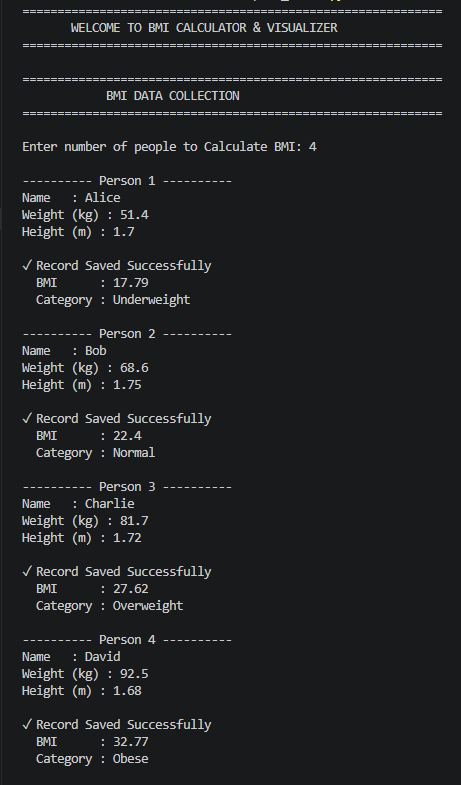
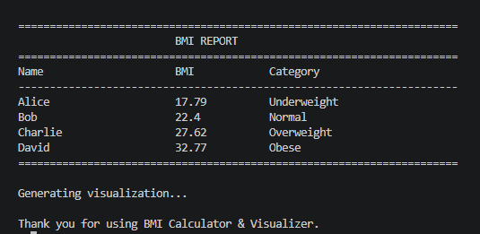
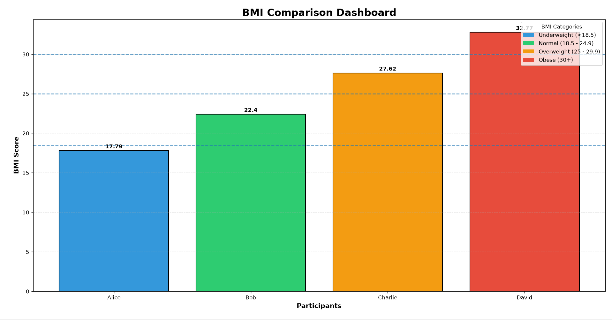

# BMI Calculator & Visualizer

A Python application that calculates Body Mass Index (BMI), classifies users into BMI categories, generates a formatted report, and displays a graphical comparison chart using Matplotlib.

## Screenshots

### Console Output


### BMI Report


### BMI Visualization Dashboard


## Features

- Calculate BMI using height and weight
- Classify BMI as:
  - Underweight
  - Normal
  - Overweight
  - Obese
- Input validation for user data
- Formatted BMI report
- Color-coded BMI visualization chart
- Support for multiple users

## Technologies Used

- Python
- Matplotlib

## Requirements

- Python 3.8+
- Matplotlib (see requirements.txt)

## Installation

1. Clone the repository:
```bash
git clone https://github.com/rishav079/bmi-calculator-visualizer.git
```

2. Install dependencies:
```bash
pip install -r requirements.txt
```

## Run the Program

```bash
python bmi.py
```

## Usage

1. Run the script using the command above.
2. Enter your height and weight when prompted.
3. View your BMI value, category, and formatted report in the console.
4. A color-coded chart will open showing your BMI visualized against standard category ranges.
5. Repeat for multiple users if needed.

## BMI Categories

| Category | BMI Range |
|-----------|-----------|
| Underweight | Below 18.5 |
| Normal | 18.5 - 24.9 |
| Overweight | 25 - 29.9 |
| Obese | 30 and above |

## Project Structure

```
bmi-calculator-visualizer/
│
├── bmi.py
├── requirements.txt
├── README.md
├── LICENSE
├── .gitignore
└── images/
    ├── BMI1.png
    ├── BMI2.png
    └── BMI3.png
```

## License

This project is licensed under the MIT License - see the [LICENSE](LICENSE) file for details.

## Author

Rishav Kaushik

## Version

1.0.0
